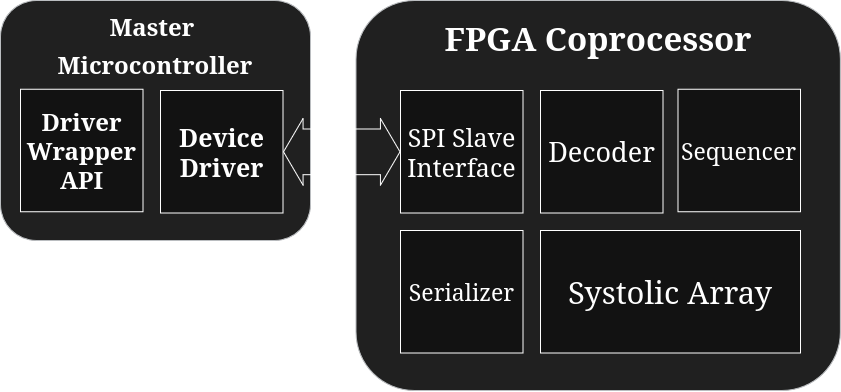
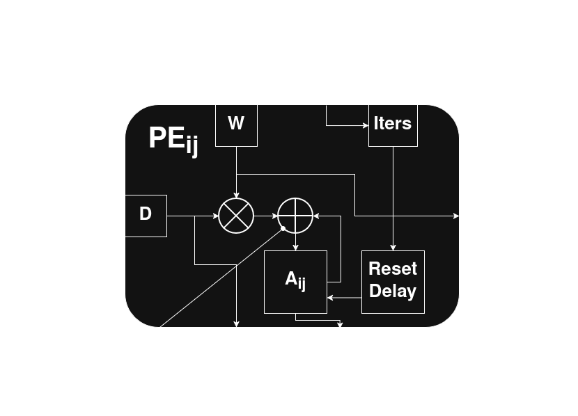
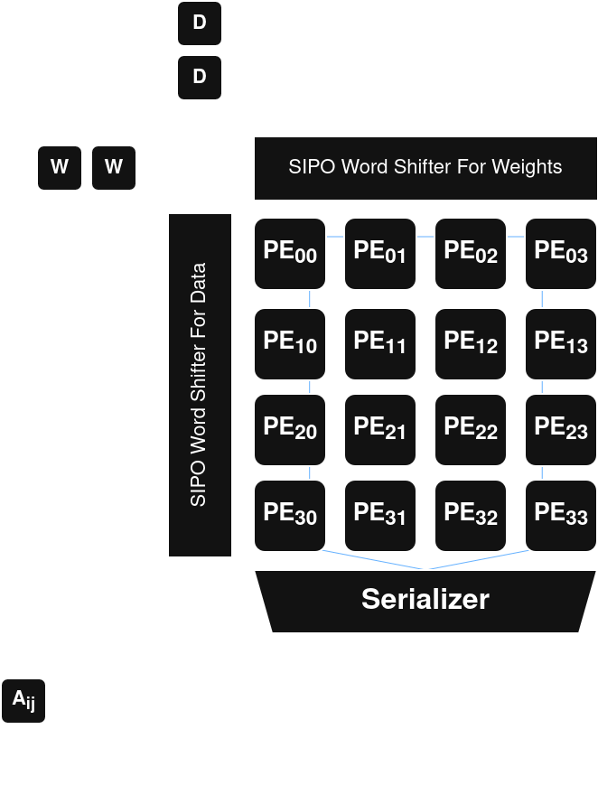
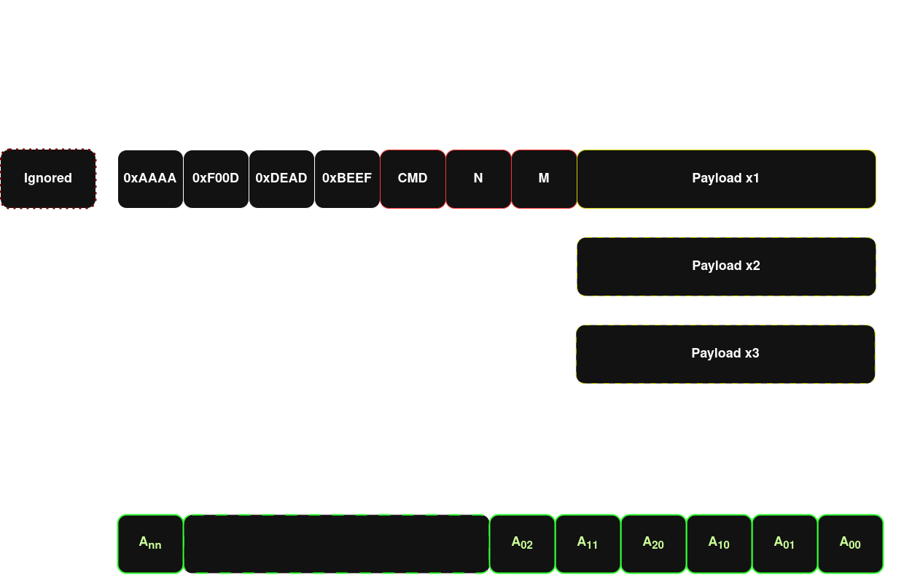
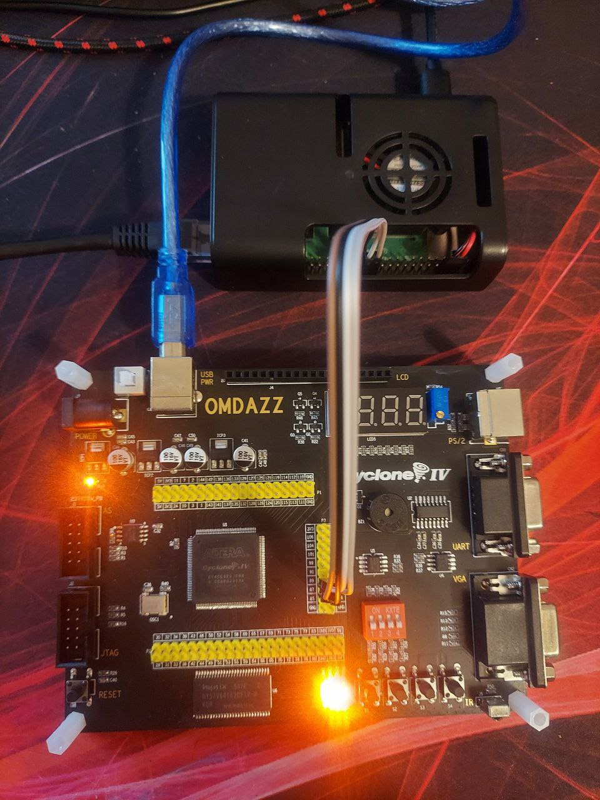
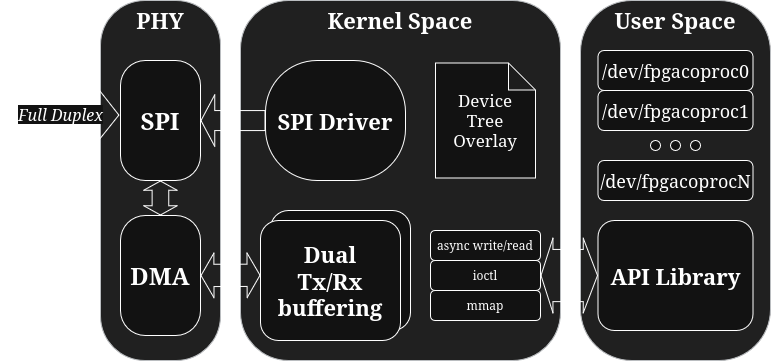

# FPGA-based Systolic Array Accelerator with Linux Device Driver

## Overview
Design and implementation of a hardware accelerator based on a systolic array architecture, implemented for FPGA target (tested on Altera Cyclone IV). The accelerator is intended for efficient computations, based on MAC operations, which are common in machine learning, signal and image processing. Includes a custom Linux device driver and a user-space API for easier integration and use within existing embedded solutions.

The key goals were:
- Efficient dataflow and parallelism using a systolic array to speedup overall performance.
- Keeping the solution to be more energy-efficient than regular CPU computing.
- Flexible to increment with additional commands and build processing algorithms on top of existing ones.
- Offloading master's CPU unit to reduce processing load.
- Seamless integration with embedded Linux through a dedicated SPI device driver.
- Simplified user-space programming via an API library.

---

## Systolic Array Principle of Operation

A systolic array is a grid of processing elements (PEs) that rhythmically compute and pass data through the array, enabling high throughput with low latency. Each PE performs multiply-accumulate operations and forwards intermediate results to neighbors, effectively parallelizing matrix multiplication.

This architecture excels at tasks requiring repetitive computations on large data streams, such as neural network inference and digital signal processing. It is not intended for short or small data samples.

---

## Project Structure

- coprocessor.qws       // Quartus project file.
- src                   // VHDL coprocessor source files with testbenches
- api                   // Userpace library API with examples.
- docs                  // Docs images and gifs.
- driver                // Linux driver for kernel version 6.12
- Makefile              // Main build Makefile.

---

## Architecture
The systolic array implemented is a NxN matrix of processing elements optimized for multiply-accumulate operations. The array utilizes internal pipelining and clock gating techniques to optimize power and timing.

Hardware implementation features:
- Arbitrary number of systolic array size.
- OS dataflow only.
- 4 to 5 pipelined stages.
- Current implementation is compatible with SPI bus only.
- Supports 16-bit signed arithmetic. Can be adjusted to different widths in `types.vhd`.
- Separated domains between SPI and system clock.
- Expects little-endian input data format.
- Utilizes FPGA logic resources efficiently but requires internal built-in multiplier units for better fitting.

### PE element

Internal PE element implementation is a OS dataflow implementation, which holds accumulated partial sum values with additional timing requirements. Each PE "knows" it's location within the systolic array and use this fact to reset it's value after specific amount of cycles based on their position and initial lag.

### Systolic Array

A network of PEs arranged to efficiently process data streams in a rhythmic, pipeline manner, enabling high-throughput parallel computation. Word shifters obtain serial input data for further parallel loading. Serializer samples completed PEs in zig-zag manner, which allows to pipeline several commands within one systolic array structure.

### Data transfer

Data transfer consists of synchronization preamble, command and arbitrary amount of payload data. For efficiency reasons data is not secured over SPI channel, because encryption will cause additional overhead.

### Prototype

---

## Device Driver
The Linux kernel device driver manages seamless communication with the accelerator over the SPI interface. DMA interface is used to offload CPU from constant data transfer.

Features include:
- DMA-based double buffering for efficient data transfer without CPU intervention.
- Character device interface under `/dev/coproc-spiN` for user-space access.
- SPI device registration using Device Tree Overlay (DTO).
- Interrupt based completion checker.

--- 

## API

The user-space API simplifies interaction with the accelerator. It provides functions to:
- `coproc_get_max_handle`   - Gets largest ID of FPGA coprocessor within the existing system. If only one coprocessor is expected, it will always return zero.
- `coproc_get_tx_buffer`    - Gets coherent DMA buffer for Tx transfer.
- `coproc_get_rx_buffer`    - Gets coherent DMA buffer for Rx transfer.
- `coproc_change_cmd`       - Changes coprocessor's command.
- `coproc_async_write`      - Start asynchronous write operation. Existing data in Tx buffer will be flushed via SPI.
- `coproc_check_completion` - Check if last operation was completed. 

---

# Examples

Examples can be found under `api/examples`.
